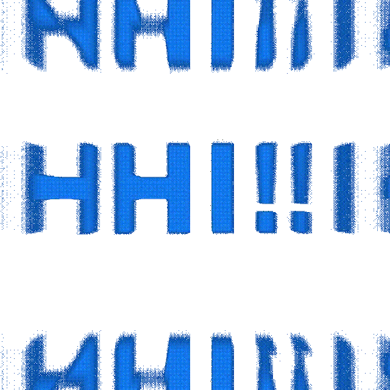

  

  

  <a href="https://github.com/gatti96">
  
  

  
    

(Portuguese)

- 👋 Olá, sou o Renan Gatti
- 👀 Estou interessado em compartilhar com vocês os meus projetos e minhas ideias.
- 🌱 No momento estou estudando HTML, CSS e JavaScript.
- 📫 Você pode me encontrar no LinkedIn (www.linkedin.com/in/renan-gatti-88aa63113) ou no e-mail: renanfrancisco96@gmail.com

(English)

- 👋 Hi, I’m Renan Gatti
- 👀 I am interested to share with you my projects and ideas.
- 🌱 I'm currently learning HTML, CSS and JavaScript.
- 📫 You can find me through my LinkedIn (www.linkedin.com/in/renan-gatti-88aa63113) or my email: renanfrancisco96@gmail.com

(Italian)

- 👋 Ciao, sono Renan Gatti
- 👀 Sono interessato a condividere con voi i miei progetti e le mie idee.
- 🌱 Adesso sto studiando HTML, CSS e JavaScript.
- 📫 Potrebbe me trovare sul LinkedIn (www.linkedin.com/in/renan-gatti-88aa63113) o nell'e-mail: renanfrancisco96@gmail.com
  
    
  
   
  
  
  
  
    

  
    
  
  
  
  
  

<!---
gatti96/gatti96 is a ✨ special ✨ repository because its `README.md` (this file) appears on your GitHub profile.
You can click the Preview link to take a look at your changes.
--->
